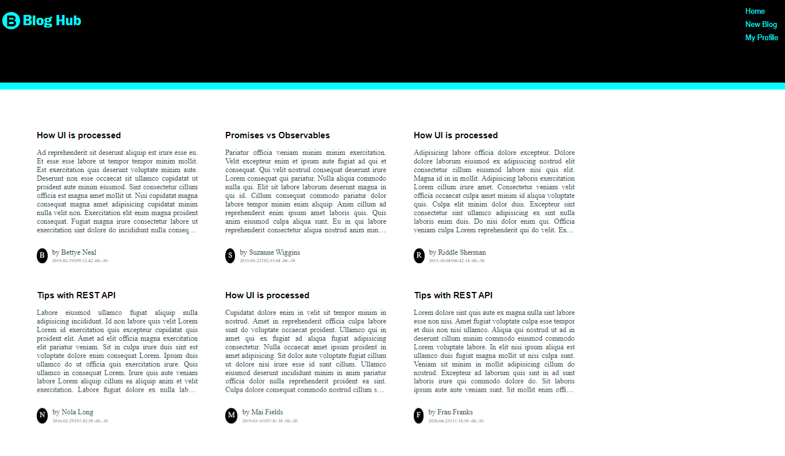
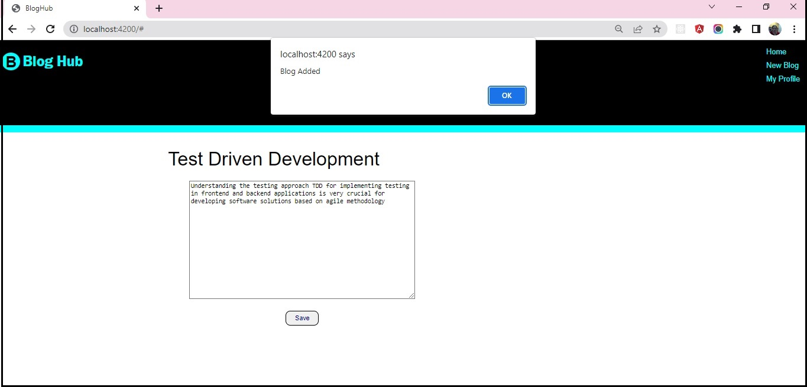
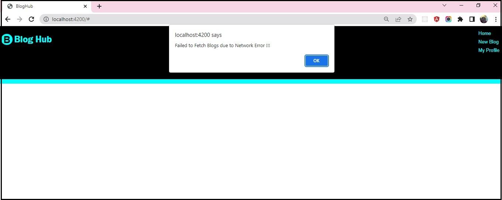

## Practice - Implement Persistence in Angular SPA

This sprint has 1 practice.

### Points to Remember

- The code provided with the boilerplate should not be modified.​
    - The boilerplate contains the code for all the components required in this application, along with the CSS styles. ​
    - The code to switch between the components is also provided.

### Instructions for Practice

- Fork the boilerplate into your own workspace. ​​​
- Clone the boilerplate into your local system. ​​​
- Open command terminal and set the path to the folder containing the cloned boilerplate code.​​​
- Run the command `npm install` to install the dependencies.​
- Open the folder containing the boilerplate code in `VS Code`.​​
- Complete the solution in the given partial code provided in the boilerplate.​

Notes:
1. The solution of this practice will undergo an automated evaluation on the `CodeReview` platform. (Local testing is recommended prior to the testing on the `CodeReview` platform)
2. The test cases are available in the boilerplate.

### Context

Blogs are the medium for sharing ideas, knowledge or opinions on various fields. The word Blog is derived from the term weblog which refers to the activity of logging content over web.

The application `Blog-Hub` is an SPA that has been designed using Angular and allows users to write and read blogs.

The design phase of the application is completed, and the UI layouts are ready to accept and present the blog data. 

As an Angular front-end developer, you are required to make the Blog-Hub application interact with the server to fetch and store blogs.


#### About the Partial Code and Data File
- The boilerplate contains the partially developed code for the `Blog-Hub` application.
    - This partially developed code has the required components created with styles. 
    - It also contains the `models` folder with a `blog.ts` file that defines the `Blog` type.
- The boilerplate also has the `blogs.json` file located under the `blog-hub-data` folder, and it contains the data of blogs in the `json` format. 
    - To allow the frontend application to interact with the blogs' data, run the `json-server` to launch the `blogs` API. 

### Problem Statement

In the given `Blog-Hub` application code, make HTTP requests to the `json-server` serving blogs data, to add and view blog data.

Along with the success response, the application should also handle the error response returned from the server.

​Note: The tasks to develop the solution are given below:

#### Task 1: Fetch Blogs

Make HTTP request to blogs API to fetch blogs data from server. The fetched data should be presented to the user neatly on the home view. The responsibility of making server calls should be handled by the Angular service.

The steps to do the above are as follows:

- Step 1: Create a service named `blog` under the `services` folder using Angular CLI command:

	`ng generate service services/blog` or `ng g s services/blog`

- Step 2: Inject `HttpClient` in the `BlogService` to make HTTP requests to the `blogs` API. 
    ```typescript
        import { Injectable } from '@angular/core';
        import { HttpClient } from '@angular/common/http';
        import { Blog } from '../models/blog';
        import { Observable } from 'rxjs';
        @Injectable({
          providedIn: 'root'
        })
        export class BlogService {  
            constructor(private http: HttpClient) { }
        }
    ```
- Step 3: Declare a string property with the name `blog_url` to store the URL of the `blogs` API. 
    ```typescript
        blog_url: string = "http://localhost:3000/blogs";
    ```
- Step 4: Define method `getAllBlogs()` in the `BlogService` that makes GET request to the `blogs` API using `HttpClient` object.
    - The method should return `Observable` that will produce data of type `Blog` array. 
        ```typescript
            getAllBlogs(): Observable<Blog[]>{
                return this.http.get<Blog[]>(this.blog_url);
            }
        ```
-  Step 5: To consume the `BlogService`: 
    - Inject `BlogService` using constructor injection mechanism into the `ViewBlogsComponent`.
        - The `ViewBlogsComponent` is designed for generating home (landing) view. 
            ```typescript 
                constructor(private blogService: BlogService) { }
            ```
    - The component should invoke the service method, `getAllBlogs()`, that makes request to the server to fetch blogs and return an `Observable` producing values of type `Blog` array.
    - The component should subscribe to the `Observable` returned and fetch the data and store it in an array of type `Blog`. 
        ```typescript
            ngOnInit(): void {
                this.blogService.getAllBlogs().subscribe(data => {
                	this.blogs = data;
               });
            }
        ```
- Step 6: In the template of the `ViewBlogsComponent`, to display the blog data use `*ngFor` directive and iterate through the `blogs` array.
    ```html
        <div class="blog-container">
            <div class="blog" *ngFor="let blog of blogs">
                <a href="#">
                <h3>{{blog.title}}</h3>
                <p>{{blog.content}}</p>
                <div class="blog-footer">
                    <span class="author-initial">{{blog.author?.charAt(0)}}</span>
                    <div class="post-details">
                        <div class="blog-author">by {{blog.author}}</div>
                        <div class="blog-date">{{blog.date}}</div>
                    </div>
                </div>
                </a> 
            </div>
        </div>
    ```
##### Expected Output


#### Task 2: Add a New Blog

The UI design to accept the blog details is available in the partial code.

Make HTTP request to `blogs` API to save blog data to server. Raise alert with text `Blog added successfully` once the blog is posted. 

The steps to do the above are as follows:
- Step 1: In the `BlogService`, define the method `saveBlog()` that accepts a blog object and posts it to the server.
    - The method should call the `post()` method of the `HttpClient` object and return the `Observable`.
        ```typescript
            saveBlog(blog: Blog): Observable<Blog> {
                return this.http.post<Blog>(this.blog_url, blog);
            }
        ```
- Step 2: To consume this service functionality:
    - Inject the `BlogService` using constructor injection mechanism into the `AddBlogComponent`.
    - The `AddBlogComponent` is designed to handle the add blog responsibility.
        ```typescript
            constructor(private blogService: BlogService) { }
        ```
- Step 3: When the `Save` button is clicked, the `AddBlogComponent` should invoke the service method that makes request to the server to post the blog data.
    - The `AddBlogComponent` should subscribe to the `Observable` returned and for the response received, it should raise alert with the message `Blog added`.
    - If the user navigates to `Home` view, the newly added blog should be visible.
        ```typescript
            saveBlog() {
                this.blogService.saveBlog(this.blog).subscribe(data => {
                    alert("Blog added");
                });
            }
        ```
##### Expected Output


#### Task 3: Handle HTTP Error Response

While making the HTTP requests to fetch or add blogs, the HTTP requests may respond with an error. Modify the `Blog-Hub` code to handle HTTP error responses. The `ViewBlogsComponent` rendering blogs and the `AddBlogComponent` posting blogs should handle the error responses while making service calls. The handling code should raise an alert with error messages to notify the user about the error.

Steps to perform this task are given below:

- Step 1: To handle an error, modify the parameter of the `subscribe()` method called on the `Observable` returned by the service.
    - The object in the `subscribe()` method should also include `error` property that is associated with the function that contains the error handling code.
        - `ViewBlogComponent`
        ```typescript
            //inside ngOnInit() method of view-blogs component
            ngOnInit(): void {
              this.blogService.getAllBlogs().subscribe({
                next: data => {
                  this.blogs = data;
                },
                error: error => {
                  alert("Error while fetching blog data !!!");
                }
              });
            }
        ```
        - `AddBlogComponent`
        ```typescript
            //inside saveBlog() method of add-blog component
            saveBlog() {
                this.blogService.saveBlog(this.blog).subscribe({
                  next: data => {
                    alert("Blog added");
                  },
                  error: error => {
                    alert("Error while adding blog data !!");
                  }
                });
            }
        ```
- Step 2: To test this functionality:
    - Change the port value in server URL with an invalid value (e.g. Change the port value to 8000)
    - Refresh the page.
    - Check the output on the browser.

##### Expected Output


### Test the Solution Locally​
Test the solution first locally and then on the `CodeReview` platform. Steps to test the code locally are:
- From the command line terminal, set the path to the folder containing cloned boilerplate code.
- Run the command `ng test` or `npm run test` to test the solution locally and ensure all the test cases pass.
- Refactor the solution code if the test cases are failing and do a re-run.​
- Finally, push the solution to git for automated testing on the CodeReview platform.

### Test the Solution on the `CodeReview` Platform
Steps to test the code on the `CodeReview` platform are:
- Open the submission page at [https://codereview.stackroute.niit.com/#/submission](https://codereview.stackroute.niit.com/#/submission).
- Submit the solution.
- For the failed test cases, refactor the code locally and submit it for re-evaluation.


